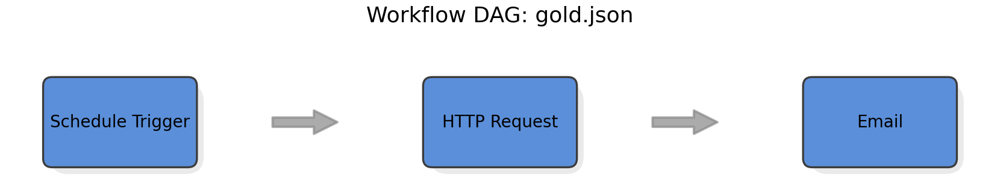

# 🔍 VeriFlow: Structural–Semantic–Executable Verification for LLM-generated Low-Code Workflows

**VeriFlow** is a lightweight verification framework for **LLM-generated low-code workflow systems** such as [n8n](https://n8n.io).  
It aims to bridge human-language task specifications and formal workflow validation through a hybrid pipeline combining structural analysis, semantic intent recognition, and sandbox-level executability simulation.
It provides **formal-inspired consistency checking** across three complementary dimensions:

- 🧩 **Structural** – graph integrity and soundness  
- 💡 **Semantic** – intent alignment and node-type adequacy (rule + LLM hybrid)  
- ⚙️ **Executable** – sandbox-based simulation and reachability validation  

The framework also includes **visualization** tools for workflow DAGs and a **batch evaluation CLI** for large-scale benchmarks.

VeriFlow is intended for researchers, workflow designers, and developers building or evaluating LLM-generated automations.

---

## 🌐 Overview

```
              Natural Language Prompt
                         │
      ┌──────────────────┴──────────────────┐
      │                                     │
🤖 Option A                              ✍️ Option B
LLM Workflow Generation                 Human-written Workflow
(gen_workflows)                         (gold.json)
      │                                     │
      └──────────────────┬──────────────────┘
                         ↓
                Workflow JSON (n8n)
                         ↓
           Intent Extraction (LLM + Rule)
                         ↓
Structural — Semantic — Executable Verification
                         ↓
                JSON Report + Visualization
```

**Veriflow** bridges low-code workflows and formal verification by:
- Supporting two workflow input paths (LLM-generated or human-written), merging into the same verification pipeline.
- Extracting **directed acyclic graph (DAG)** structures from n8n workflows;
- Computing **multi-criteria structural metrics**;
- Checking **semantic alignment** via rule-based and LLM-assisted intent recognition;
- Executing workflows in a **safe sandbox** (no external API calls);
- Producing detailed **JSON reports** and **graphical DAG visualizations**.

---

## 🔧 LLM-based Workflow Generation
Veriflow now includes an integrated module gen_workflows to generate n8n workflows directly from natural-language prompts, enabling automatic creation of benchmark datasets:
```
Prompt File (W5.txt)
        ↓
gen_workflows (LLM-based generator)
        ↓
Generated Workflows under bench/GenLLM/W5/
        ↓
veriflow verify / bench
```

## 🧠 Core Features

| Category                     | Description                                                                                                                |
| ---------------------------- | -------------------------------------------------------------------------------------------------------------------------- |
| **Structural analysis**      | Connectivity, acyclicity, orphan-ratio, out-degree balance, and exit coverage.                                             |
| **Semantic checking**        | Hybrid rule + LLM mode for intent extraction (trigger, action, order, etc.).                                               |
| **Executability simulation** | Sandbox execution without network calls; detects missing parameters or unreachable nodes.                                  |
| **Hybrid scoring**           | Weighted aggregation `Overall = α·S + β·M + γ·E` with normalized weights.                                                  |
| **Batch benchmarking**       | Evaluate multiple workflows under `bench/`; export per-case reports and CSV summaries.                                     |
| **Visualization**            | Generate publication-quality DAGs with rounded nodes, shadows, and highlighted execution paths.                            |
| **LLM Workflow Generation**  | Generate n8n workflows from prompts using veriflow.cli gen-workflows, producing structured benchmarks under bench/GenLLM/. |

---

## 📦 Installation

### 1. Clone the repository
```bash
git clone https://github.com/ahzm/veriflow.git
cd veriflow
```

### 2. Create environment
```bash
conda env create -f environment.yml
conda activate veriflow
```

#### Dependencies:
- python=3.10
- networkx, matplotlib, pandas, typer, rich, openai, tiktoken

## Usage
### 0.  Generate workflows from prompts (Optional)
You can automatically generate n8n workflows from natural-language prompts:
```bash
python -m veriflow.cli gen-workflows \
  --prompts bench/GenLLM/prompts/W5.txt \
  --out bench/GenLLM/W5 \
  --overwrite
```
This produces structured workflow cases:
```
bench/GenLLM/W5/
  ├── W5_01/
  │   ├── prompt.txt
  │   └── W5_01.json
  ├── W5_02/
  │   ├── prompt.txt
  │   └── W5_02.json
  ...
```
These generated workflows can then be validated using verify or bench.

### 1. Verify a single workflow
Runs structural, semantic, and executability checks on one workflow.
```bash
python -m veriflow.cli verify \
  --input bench/T001/gold.json \
  --prompt "$(cat bench/T001/prompt.txt)" \
  --use-llm --sandbox --report experiments/results/T001_detail.json -v
```
#### Output Example
```
StructuralScore:   0.99
SemanticScore:     1.00
ExecutabilityScore:1.00
Overall:           1.00
[ok] wrote report to experiments/results/T001_detail.json
```

### 2. Visualize a workflow DAG
VeriFlow can generate DAG diagrams from workflow JSON files.
Below is an example visualization generated using:
```bash
python scripts/plot_dag.py \
  -i bench/T001/gold.json \
  -o experiments/results/T001_dag.png
```
<p align="center">
  
</p>

### 3. Verify a bench of workflows
Runs batch verification and exports CSV + detailed reports.
```bash
python -m veriflow.cli bench \  
  --glob "bench/GenLLM/W20C/*/*.json" \ 
  --out experiments/results/GenLLM_W20C.csv \      
  --use-llm \
  --sandbox \
  --dump-details
```
 
## 🧩 Architecture

```
veriflow/
├── veriflow/                   # Core framework
│   ├── cli.py                  # Main CLI entry (verify / bench commands)
│   ├── structural/             # Structural validation
│   │   ├── checker.py          # Static schema checking
│   │   └── schema.py           # Workflow schema definitions
│   ├── semantic/               # Semantic consistency
│   │   ├── intent_extractor.py # Intent extraction
│   │   └── matcher.py          # keyword matching
│   ├── generator/              # Produce n8n JSON workflows from prompts
│   │   └── genllm.py           # LLM-based workflow generation
│   ├── executable/             # Executability validation
│   │   ├── sandbox.py          # validate workflow in sandbox
│   │   └── dryrun.py           # Dry-run simulation
│   └── utils/                  # Shared helpers
│       ├── io.py               # JSON & figure I/O utilities
│       ├── logger.py           # unified logging configuration
│       └── graph.py            # Build and traverse workflow DAG
│
├── bench/                      # VeriFlow-Bench dataset
│   └── T001/                   # Example task
│       ├── prompt.txt          # Natural language prompt
│       └── gold.json           # Ground-truth workflow
│
├── experiments/                # Experimental results & configs
│   └── results/
│       ├── report.csv          # Aggregated scores
│       └── score_plot.png      # Visualization
│
├── scripts/                    # Utility scripts
│   ├── plot_dag.py             # Plot DAG
│   └── plot_results.py         # Plot S/M/E/Overall charts
│
├── environment.yml             # Reproducible environment
├── Makefile                    # Shortcut commands
├── LICENSE                     # MIT License
└── README.md                   # Project overview and usage
```

## 📈 Example Report Structure
```json
{
  "scores": { "S": 0.99, "M": 1.0, "E": 1.0, "Overall": 1.0 },
  "issues": [],
  "struct_detail": {
    "connected_ratio": 1.0,
    "acyclic": 1.0,
    "orphan_ratio": 0.0,
    "final_S": 0.99
  },
  "semantic_detail": {
    "intent_conf": 0.92,
    "source": "rule+llm",
    "intent": { "need_email": true, "need_http": true, "need_schedule": true }
  },
  "exec_detail": {
    "executed_nodes_readable": ["Schedule Trigger", "HTTP Request", "Email"],
    "runtime_ok": 1.0
  }
}
```

## 📊 Benchmarks

VeriFlow includes the **GenLLM** benchmark, containing more than **700 LLM-generated workflows**.  
Among these, **690 workflows** form the evaluation subset used in our experiments.
(The remaining workflows include auxiliary cases for tool debugging and are not part of the main evaluation.)

The benchmark is constructed from structured natural-language prompt sets:
- **Wk**:   k unconstrained prompts (e.g., W10, W20, W60, W100)  
- **WkC**: constrained prompts with nested conditions, multi-trigger logic, and stricter behavioral requirements

Each prompt corresponds to one generated n8n workflow under:
```
bench/GenLLM/W30/
bench/GenLLM/prompts/W30.txt
```
These datasets support large-scale evaluation of structural, semantic, and executable verification.

## 🧭 Milestones (Implemented)
- ✅ Structural metrics with robustness for small DAGs
- ✅ Hybrid semantic mode (rule + LLM)
- ✅ LLM-based workflow synthesis (veriflow.generator.genllm + CLI: gen-workflows)
- ✅ Sandbox execution validator (parameter & reachability checks)
- ✅ Unified CLI with JSON export and verbose diagnostics
- ✅ Publication-grade DAG plotting with highlighted paths
- ✅ Logging and I/O utilities (veriflow.utils)
- ✅ Benchmark suite support (bench/*)

## 📚 Citation
If you use VeriFlow in scientific publications, please cite:

```bibtex
@misc{veriflow2025,
  title = {VeriFlow: A Framework for Multi-Dimensional Verification of LLM-generated Low-Code Workflows},
  year = {2025},
  url = {https://github.com/ahzm/veriflow}
}
```